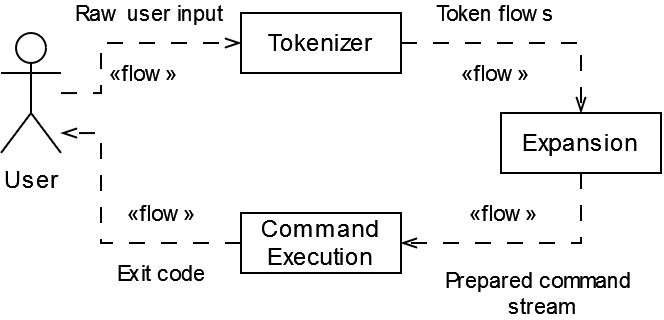
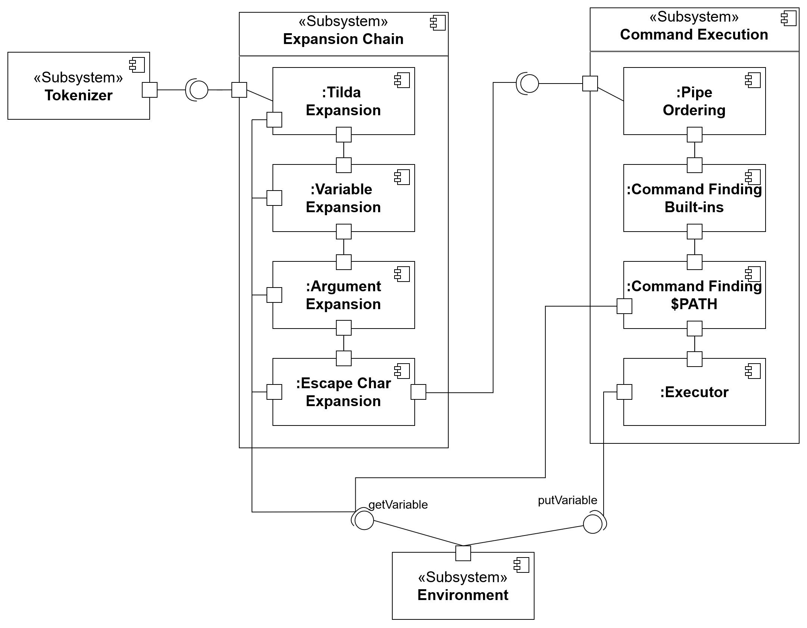

# Oh My GOSH
Реализация простого shell на языке Go

## Схема работы проекта

Рассмотрим поток данных, который происходит во время исполнения приложения.
Запрос пользователя проходит через весь пайплайн, после чего ему возвращается
код выполнения программы (конкретно, он устанавливается в переменную окружения)

Если же мы рассмотрим то, как выглядят данные компоненты на "увеличенном" масштабе,
то мы получим следующую схему компонентов

